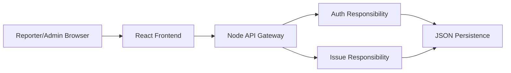
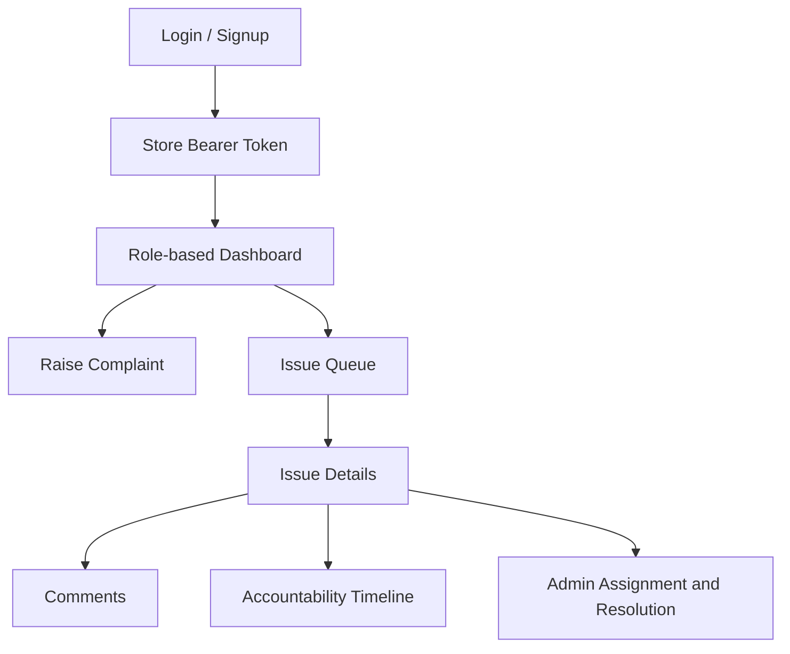

# Architecture

## Overview

The prototype is deployed as one Node.js process for easy evaluation, but the code and routes are organized around service boundaries expected in a microservice-style backend:

- API gateway: `server/index.js`
- Auth service responsibility: signup, login, logout, token validation
- Issue service responsibility: complaint CRUD, assignment, status workflow, comments, timeline
- Persistence service responsibility: JSON database read/write in `server/db.js`
- Security utility responsibility: token creation and password hashing in `server/security.js`
- React frontend: `frontend/src/app.js`

For a production deployment, the auth and issue responsibilities can be split into independent services behind the same gateway routes.

## Request Flow

## Frontend Flow

## Backend Responsibilities

| Area | Responsibility |
| --- | --- |
| API gateway | Receives HTTP requests, routes `/api/*`, serves frontend assets |
| Auth | Creates reporter accounts, verifies credentials, stores sessions |
| Issue workflow | Creates issues, filters queues, updates statuses, assigns admins |
| Accountability | Records all issue creation, assignment, status changes, and comments |
| Persistence | Stores users, sessions, and issues in a JSON database file |

## Security Assumptions

- Token-based auth is simulated for assignment demonstration.
- Passwords are SHA-256 hashed with a salt.
- Admin users are seeded.
- Signup creates reporter accounts only.
- Admin-only routes reject reporter access.

## Scalability Notes

The JSON persistence layer is intentionally simple for a prototype. In a larger deployment:

- Replace `server/data/db.json` with PostgreSQL or MongoDB.
- Move auth and issue services into separate deployable services.
- Add request logging, pagination, email notifications, file attachments, and stricter password hashing such as bcrypt or Argon2.
