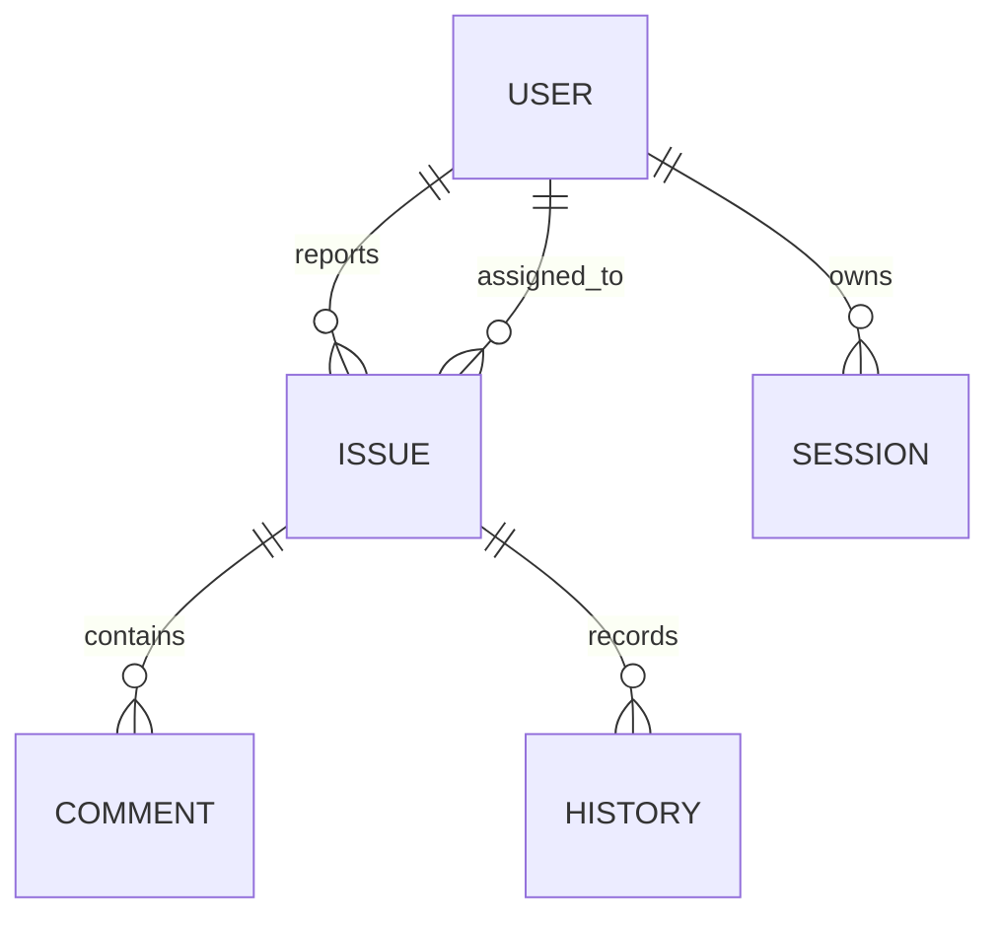

# Database Schema

The prototype stores data in `server/data/db.json`. The file is created automatically on first run.

## `users`

| Field | Type | Description |
| --- | --- | --- |
| `id` | string | Unique user ID |
| `name` | string | Display name |
| `email` | string | Login email |
| `role` | string | `user` or `admin` |
| `department` | string | Department/team |
| `passwordHash` | string | Salted SHA-256 password hash |
| `createdAt` | ISO string | Creation timestamp |

## `sessions`

| Field | Type | Description |
| --- | --- | --- |
| `token` | string | Bearer token |
| `userId` | string | Owner user ID |
| `createdAt` | ISO string | Login timestamp |
| `lastSeenAt` | ISO string | Reserved for activity tracking |

## `issues`

| Field | Type | Description |
| --- | --- | --- |
| `id` | string | Unique issue ID |
| `title` | string | Short complaint title |
| `category` | string | Facilities, Network, Equipment, Safety, Cleanliness, Other |
| `priority` | string | Low, Medium, High, Critical |
| `status` | string | Open, Assigned, In Progress, Resolved, Reopened, Closed, Rejected |
| `location` | string | Physical or logical location |
| `description` | string | Reporter-provided details |
| `reporterId` | string | User who raised the complaint |
| `assigneeId` | string/null | Admin responsible for resolution |
| `dueDate` | date string | SLA target date |
| `resolution` | string | Admin resolution notes |
| `createdAt` | ISO string | Created timestamp |
| `updatedAt` | ISO string | Last update timestamp |
| `closedAt` | ISO string/null | Resolution/closure timestamp |
| `comments` | array | Issue discussion |
| `history` | array | Immutable accountability timeline |

## `comments`

| Field | Type | Description |
| --- | --- | --- |
| `id` | string | Unique comment ID |
| `authorId` | string | Comment author |
| `authorName` | string | Cached display name |
| `message` | string | Comment content |
| `createdAt` | ISO string | Comment timestamp |

## `history`

| Field | Type | Description |
| --- | --- | --- |
| `id` | string | Unique timeline event ID |
| `actorId` | string | User who performed the action |
| `actorName` | string | Cached display name |
| `action` | string | Event label |
| `detail` | string | Human-readable event description |
| `createdAt` | ISO string | Event timestamp |

## Relationships

